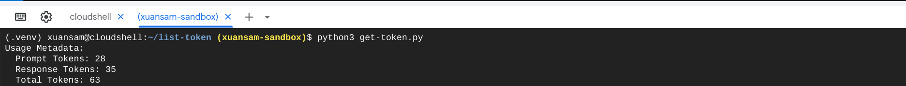

# List and count tokens

- [List and count tokens](https://cloud.google.com/vertex-ai/generative-ai/docs/multimodal/list-token)

## How to use

Prefer to use your Cloud Shell terminal, not the Cloud Shell Editor's terminal. This is because Cloud Shell terminal comes with multiple pre-defined environment variables that help to run this directly.

1. Open Cloud Shell. Or Go to your Cloud Shell: [shell.cloud.google.com](https://shell.cloud.google.com).
2. Clone this repo.
3. From your Shell, `cd` to the folder of the repo.
4. Update/key in your prompt into the `prompt.txt` file.
5. Optional: create your own `.venv` venv and use it.
6. Install dependencies with `pip3 install -r requirements.txt`.
7. Optional: create your own `.venv` venv.
8. Run the tools with `python3 list_token.py` and `python3 get_token.py`.

## Examples

- `get-token`:



- `list-token`:


## The `.env` file

```python
GOOGLE_CLOUD_PROJECT = "your project id"
GOOGLE_CLOUD_LOCATION = "your preferred region to run the model"
GOOGLE_GENAI_USE_VERTEXAI = "True" # It must be True
```

## Enhancements

- [ ] TODO: Convert this into module/package instead of a simple script.
- [ ] TODO: Handle different languages which use UTF-8.
- [ ] TODO: Multimodal input/output values, ie. load a photo or audio file instead of text file.
